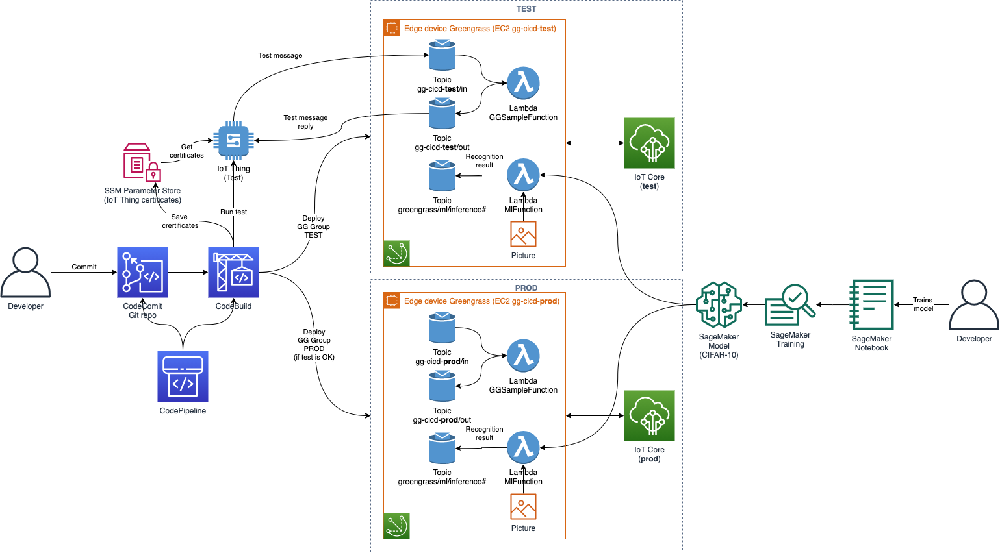

# gg-cicd

Demo of a CI/CD pipeline which deploys a "regular" Lambda which echoes messages and a ML inference Lambda which does image recognition to Greengrass into a `test` environment and if all tests pass there, then the functions are deployed to the `prod` environment.

Here is the architecture diagram of the deployment:



Clone the repo with submodules:

```bash
git clone --recurse-submodules
```

Deploy the SageMaker CF from <https://iot.awsworkshops.com/aws-greengrass-ml/lab43-mlsagemakerworkshop/> in [AWS Console](https://console.aws.amazon.com/cloudformation/home?region=us-west-2#/stacks/new?stackName=ggmlworkshop&templateURL=https://s3-us-west-2.amazonaws.com/iotworkshop/lab43-sagemaker.json)  or in CLI:

```bash
aws cloudformation deploy --template-file lab43-sagemaker.json --stack-name ggmlworkshop --capabilities CAPABILITY_IAM
```

Train the model as it's described in <https://iot.awsworkshops.com/aws-greengrass-ml/lab43-mlsagemakerworkshop/>

Copy the training job ARN and paste it into `SageMakerJobArn` [./aws-gg-ml-cicd-project/src/template.yml](aws-gg-ml-cicd-project/src/template.yml)[166].

Follow <https://aws.amazon.com/blogs/iot/implementing-a-ci-cd-pipeline-for-aws-iot-greengrass-projects/>

* Deploy the `test` GG group in [AWS Console](https://console.aws.amazon.com/cloudformation/home?region=us-east-1#/stacks/create/review?templateURL=https://aws-iot-blog-assets.s3.amazonaws.com/cicd-pipeline-aws-iot-greengrass/gg-cicd-environment-stack.yml&stackName=gg-cicd-test-environment&param_CoreName=gg-cicd-test) or in CLI:

```bash
aws cloudformation deploy --template-file gg-cicd-environment-stack.yml --stack-name gg-cicd-test-environment --capabilities CAPABILITY_IAM --parameter-overrides CoreName=gg-cicd-test myKeyPair=<your-key>
```

* Deploy `prod` GG group in [AWS Console](https://console.aws.amazon.com/cloudformation/home?region=us-east-1#/stacks/create/review?templateURL=https://aws-iot-blog-assets.s3.amazonaws.com/cicd-pipeline-aws-iot-greengrass/gg-cicd-environment-stack.yml&stackName=gg-cicd-prod-environment&param_CoreName=gg-cicd-prod) or in CLI:

```bash
aws cloudformation deploy --template-file gg-cicd-environment-stack.yml --stack-name gg-cicd-prod-environment --capabilities CAPABILITY_IAM --parameter-overrides CoreName=gg-cicd-prod myKeyPair=<your-key>
```

* Deploy the CI/CD pipeline in [AWS Console](https://console.aws.amazon.com/cloudformation/home?region=us-east-1#/stacks/create/review?templateURL=https://aws-iot-blog-assets.s3.amazonaws.com/cicd-pipeline-aws-iot-greengrass/gg-cicd-pipeline-stack.yml&stackName=gg-cicd-pipeline) or in CLI:

```bash
aws cloudformation deploy --template-file gg-cicd-pipeline-stack.yml --stack-name gg-cicd-pipeline --capabilities CAPABILITY_IAM --parameter-overrides CoreName=gg-cicd-prod 
```

Deploy the project:

```bash
cd aws-gg-ml-cicd-project/test
./setup_parameter_store.sh
cd ..
```

Add the newly provisioned CodeCommit repo as an origin to the Git module `aws-gg-ml-cicd-project` and push the Git module code to your CodeCommit repo to kick off the pipeline:

```bash
git remote add codecommit <code-commit-repo>
git push codecommit main:master
```

Check in CodePipeline that the deployment is successful.

To test the "echo" function go to "Interacting with the deployed Lambda function" section of the blog post.

To test the ML inference, subscribe to the topic `greengrass/ml/inference/#` in the MQTT test client of AWS IoT console. Then log into the `test` GG instance with SSH and place an image to recognize in the input directory:

```bash
ssh -i <key> ubuntu@<addr>
sudo bash
cd /greengrass-ml/images/cifar10
wget https://github.com/YoongiKim/CIFAR-10-images/raw/master/test/bird/0000.jpg
```

Within 5 sec you should see a message below in the MQTT test client:

```json
{
  "image": "0000.jpg",
  "class": "deer"
}
```

## TODO

Upgrade to GG2.

In the Jupyter script rename `train_instance_type` to `instance_type` to comply with SageMaker v2.

Add a test which will download the image (using SSM run command?) on the test machine and will await for the inference MQTT message.

Save the last SM training job in SSM param store and read it in the deployment.

## Resources

* <https://aws.amazon.com/blogs/iot/implementing-a-ci-cd-pipeline-for-aws-iot-greengrass-projects/>

* <https://iot.awsworkshops.com/aws-greengrass-ml/lab43-mlsagemakerworkshop/>

## Maintenance

Push the changes in the submodule to CodeCommit and to the GitHub:

```bash
git push codecommit main:master
git push origin
```

```bash
git submodule update --remote
git submodule update --remote --rebase
git submodule update --init --recursive
```

Unstuck deletion of custom resources <https://aws.amazon.com/premiumsupport/knowledge-center/cloudformation-lambda-resource-delete/>
